# QBE-style Portfolio Optimisation Research Lab - Report

_**Data: SYNTHETIC fallback** - a real-data fetch was configured but unavailable in this environment (RuntimeError: FMP_API_KEY not set in the environment.), so the transparent factor model was used. Numbers are illustrative; they become real the moment the configured provider (FMP/Yahoo) is reachable or an FMP key is supplied. Generated by `python src/main.py`. Every number reconciles to a CSV in `outputs/tables/`; real data is a config change (`data.source: real` + `market_data` tickers)._

## Executive read

This report answers one question: **how should an institutional insurance portfolio be constructed when several competing objectives apply at once?** It does that by *comparing* portfolio-construction philosophies rather than crowning a single optimiser, then putting every portfolio through the same evaluation lenses an insurer actually manages to - return, **regulatory capital**, **earnings stability**, **accounting (P&L vs OCI)** and **asset-liability duration**.

- **Part A - Construction philosophies** builds the candidate portfolios (equal weight, mean-variance, minimum variance, risk parity, maximum diversification, plus the capital-aware optimisers) and scores them on one identical metric set.
- **Part B - Evaluation lenses** stress-tests, capital-charges, earnings-tests and ALM-tests the book, showing why two portfolios with the same Sharpe can differ sharply on capital, drawdown and earnings.

The single comparison table below is the heart of the lab; everything after it explains the trade-offs it exposes.

The framing follows the way the problem was put to us: there are really **two big lenses**. The first is *mean-variance* - well understood, many ways to do it - which here becomes a whole family of construction philosophies (Part A). The second is everything mean-variance ignores: shocks do not happen in isolation, an insurer is judged on its **annual earnings plan** not a point-in-time Sharpe, and **capital** (not volatility) is usually the binding constraint (Part B). The aim is not a portfolio that is optimal on one axis but one that is **acceptable across all of them** - and, where possible, a change that improves several at once (growing the pie rather than re-slicing it).

**How to read each section below.** Every lens is written to the same five beats so the reasoning is explicit: _Why this lens_ (why it is looked at), _What it means_, _How it is calculated_ (how it was researched and computed), _What we found_ (the result on this book), and _What to study next_.

## Part A - Portfolio construction philosophies

### A1. The philosophies

Each optimiser is independent and produces a `Portfolio` scored on the same metrics. Risk parity and maximum diversification are solved under the **same insurer constraints** as mean-variance (min 80% core fixed income, currency buckets, per-asset caps), so the comparison is like-for-like; equal weight is the deliberately unconstrained naive 1/N benchmark.

- **Equal weight (1/N)** - no optimisation, no mandate constraints: the bar every optimiser must beat.
- **Mean-variance (Max-Sharpe)** - most return per unit of volatility within the constraints.
- **Minimum variance** - lowest achievable volatility.
- **Risk parity** - every asset contributes an equal share of portfolio risk.
- **Maximum diversification** - maximises the diversification ratio (weighted-avg asset vol / portfolio vol).
- **Black-Litterman** - equilibrium returns (reverse-optimised from the book) blended with explicit views.
- **Robust** - resampled (Michaud) max-Sharpe, stable to estimation error.
- **ML-Forecast** - expected returns from a pooled ridge on momentum / reversal / carry / vol signals.
- **Capital-aware (Max-RoC, Capital-Budgeted, Min-EarningsVol)** - optimise return per unit of, or subject to, capital / earnings stability.
- **Pareto-Balanced** - the best book that dominates the baseline on every objective (see A3).
- **Baseline / Risk 20%** - the insurer's strategic book and a risk-scaled scenario for reference.

**Why this lens.** Every philosophy encodes a different *belief* about what is knowable. Mean-variance trusts the return forecast; minimum variance and risk parity distrust it and lean only on the covariance; equal weight distrusts everything. Building them side by side stops us over-fitting to one worldview - exactly the 'don't get stuck in one way of thinking' instruction.

**How it is calculated.** Each optimiser is an independent function in `src/optimizer.py` / `src/construction.py` that returns a `Portfolio`. Forward `exp_return` assumptions drive return; the historical covariance drives risk. Risk parity and maximum diversification are solved (SLSQP) under the *same* mandate constraints as mean-variance so the contest is fair; equal weight is left unconstrained as the naive control.

**What to study next.** Wire in the scaffolded **Black-Litterman** (blend equilibrium with views) and **robust** optimisers, then newer philosophies - ML return forecasts, regime-switching, Bayesian / multi-objective - all behind the same comparison so they are judged on identical metrics.

### A2. Side-by-side comparison

Every portfolio, every headline metric (the full set, including the retained context columns, is in `outputs/tables/portfolio_comparison.csv`):

| metric | exp_return | volatility | sharpe | sortino | max_drawdown | var_95 | cvar_95 | duration | capital_charge | stress_loss | liquidity | diversification_ratio | turnover |
|---|---|---|---|---|---|---|---|---|---|---|---|---|---|
| Baseline | 0.0509 | 0.0328 | 1.7504 | 3.4860 | -0.1614 | -0.0092 | -0.0150 | 4.1668 | 0.0254 | -0.1126 | 7.5525 | 1.8251 | 0.0000 |
| Equal-Weight | 0.0564 | 0.0373 | 1.5393 | 2.8740 | -0.1228 | -0.0113 | -0.0189 | 3.1286 | 0.0457 | -0.1171 | 6.1905 | 1.8612 | 0.3479 |
| Max-Sharpe | 0.0508 | 0.0170 | 2.1465 | 4.0732 | -0.0449 | -0.0033 | -0.0078 | 1.8889 | 0.0211 | -0.0617 | 7.2901 | 2.1293 | 0.6721 |
| Min-Variance | 0.0472 | 0.0157 | 1.9688 | 3.6572 | -0.0513 | -0.0033 | -0.0072 | 2.0662 | 0.0129 | -0.0630 | 7.8050 | 2.1312 | 0.6689 |
| Risk-Parity | 0.0493 | 0.0223 | 1.9177 | 3.8529 | -0.0823 | -0.0063 | -0.0095 | 2.6346 | 0.0201 | -0.0773 | 7.4820 | 2.1122 | 0.4164 |
| Max-Diversification | 0.0486 | 0.0188 | 1.8748 | 3.8693 | -0.0591 | -0.0048 | -0.0071 | 2.0196 | 0.0154 | -0.0623 | 7.8067 | 2.4048 | 0.5917 |
| Black-Litterman | 0.0507 | 0.0322 | 1.7621 | 3.5746 | -0.1527 | -0.0083 | -0.0145 | 3.9480 | 0.0262 | -0.1069 | 7.5195 | 1.9290 | 0.0703 |
| Robust | 0.0506 | 0.0170 | 2.1410 | 4.0522 | -0.0463 | -0.0035 | -0.0079 | 1.9225 | 0.0203 | -0.0625 | 7.3452 | 2.1492 | 0.6337 |
| ML-Forecast | 0.0523 | 0.0183 | 2.1448 | 4.1305 | -0.0472 | -0.0030 | -0.0084 | 1.8464 | 0.0260 | -0.0670 | 7.0318 | 1.9701 | 0.6978 |
| Max-RoC | 0.0439 | 0.0291 | 1.5693 | 3.0001 | -0.1499 | -0.0081 | -0.0133 | 3.8932 | 0.0103 | -0.0844 | 9.0806 | 1.4395 | 0.5530 |
| Capital-Budgeted | 0.0588 | 0.0347 | 1.5919 | 2.5860 | -0.1531 | -0.0081 | -0.0212 | 2.8848 | 0.0355 | -0.1211 | 6.2957 | 1.6213 | 0.6914 |
| Risk 20% | 0.0521 | 0.0337 | 1.7263 | 3.4509 | -0.1584 | -0.0102 | -0.0154 | 4.0426 | 0.0299 | -0.1122 | 7.3569 | 1.8378 | 0.0416 |
| Min-EarningsVol | 0.0528 | 0.0227 | 1.6598 | 2.8974 | -0.0854 | -0.0055 | -0.0120 | 1.7212 | 0.0271 | -0.0879 | 7.0608 | 1.9580 | 0.6137 |
| Pareto-Balanced | 0.0512 | 0.0212 | 1.8556 | 3.2421 | -0.0724 | -0.0051 | -0.0113 | 2.4588 | 0.0174 | -0.0782 | 7.3619 | 1.8471 | 0.7252 |

_VaR / CVaR are historical monthly 95% figures (signed; negative = loss); stress loss is the worst instantaneous scenario; turnover (and tracking error, in the CSV) is measured against the Baseline book._

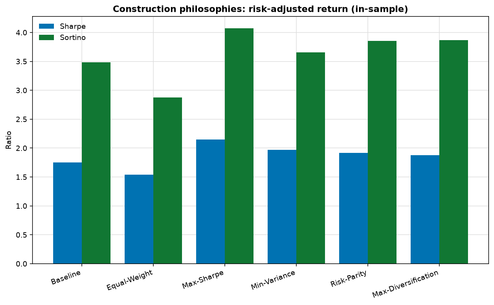

*Figure 1. Risk-adjusted return (Sharpe & Sortino) across the construction philosophies.*

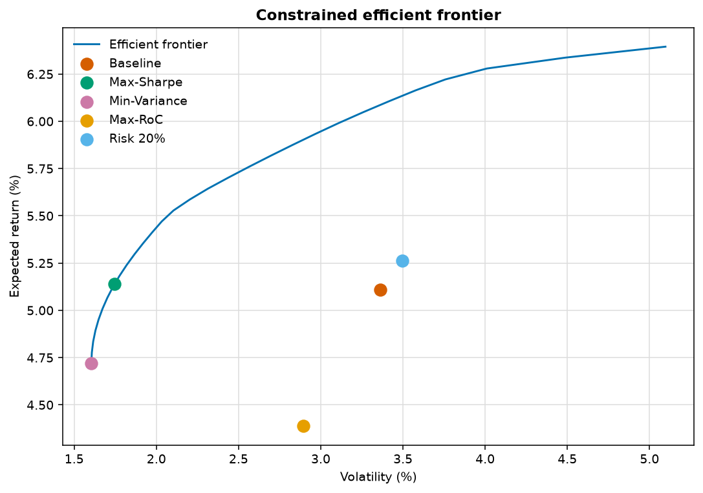

*Figure 2. Constrained efficient frontier with each philosophy plotted.*

**What it means.** Read each row as a portfolio and each column as a lens. The right-most columns (capital charge, stress loss, turnover) are where philosophies that look identical on return/volatility separate - which is the whole argument for not optimising a single number.

**What we found.** Within the insurer constraints the **Max-Sharpe** book reaches expected return **5.08%** at volatility **1.70%** (Sharpe 2.15) versus the baseline at **5.09%** / **3.28%**; **Min-Variance** and **Risk-Parity** trade return for stability, while **Equal-Weight** takes the most risk and the largest turnover to implement. No single portfolio wins every column.

**What to study next.** Add the objective that is actually binding for the business each period (capital, earnings stability) as a constraint and search for **Pareto improvements** - moves that help one lens without hurting the others - rather than a single 'optimal' point.

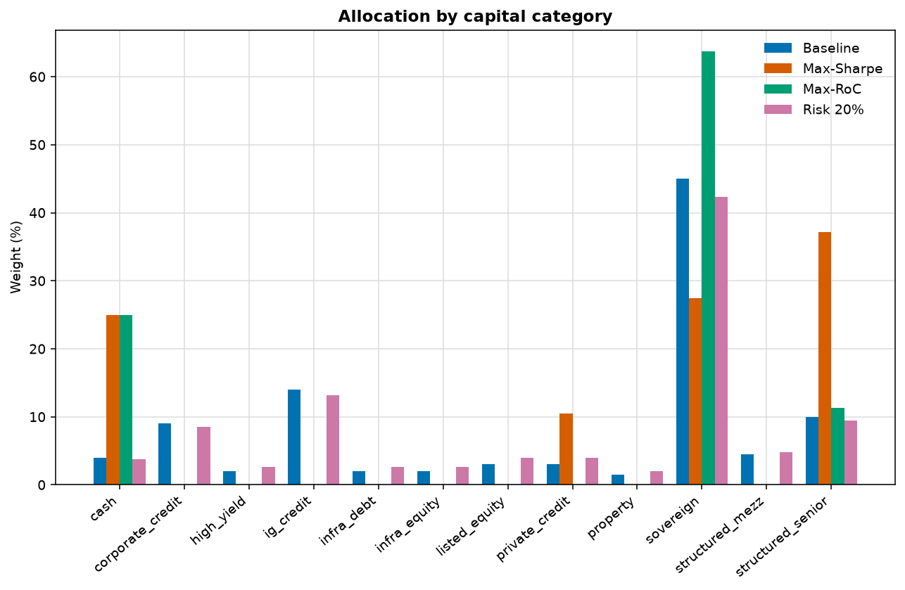

*Figure 3. Allocation by capital category across philosophies.*

### A3. Pareto improvements over the current book

**Why this lens.** The philosophies above each optimise *one* thing. The sharper question for the business is whether a book exists that is **at least as good as today's on every objective at once** - return, volatility, capital, earnings volatility and worst-case stress - and strictly better on some. That is a Pareto improvement: growing the pie, not re-slicing it.

**How it is calculated.** Epsilon-constraint search: maximise expected return subject to hard caps on **capital** and **earnings (P&L) volatility** (the smooth quadratic proxy) and total volatility, sweeping those caps from their best-achievable level up to the baseline's. Every solution is then scored on all five objectives and tested for Pareto-dominance over the current book.

**What we found.** **8 of the searched portfolios dominate the baseline** on every objective. The current book sits at return 5.09%, vol 3.28%, capital 3.77%, earnings-vol 2.74%, worst-stress -11.26% - and is strictly beaten on all of them. The best-balanced dominating book (**Pareto-Balanced**, shown in the Part A table) earns the same-or-more return at materially lower capital, earnings volatility and stress.

**What to study next.** Add turnover and tracking-error to the dominated set so the cheapest *implementable* improvement is chosen, then re-run as constraints tighten (e.g. a hard capital budget) to trace the efficient surface, not just dominance over one point.

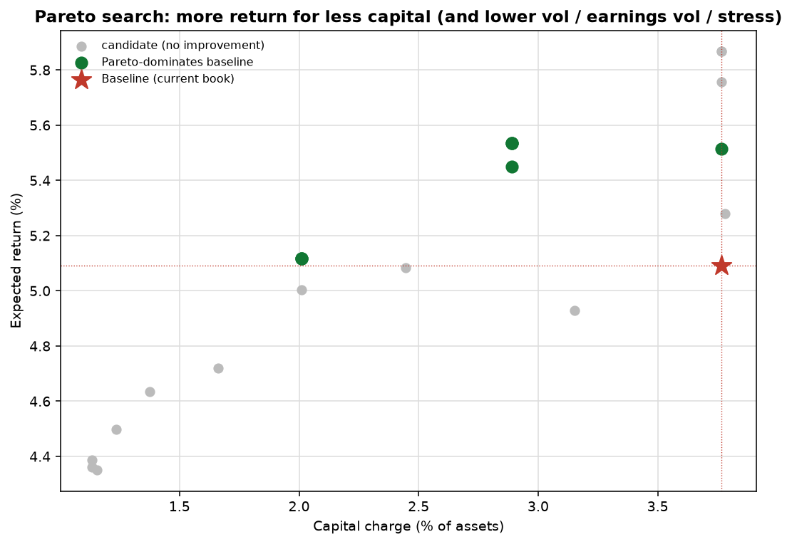

*Figure 3b. Pareto search - books beating the current one on return AND capital (and, by construction, on volatility, earnings volatility and stress).*

Portfolios that dominate the baseline (all objectives at least as good, some strictly better):

| metric | exp_return | volatility | capital | earnings_vol | worst_stress |
|---|---|---|---|---|---|
| eps c=0.020 e=0.017 | 0.0512 | 0.0212 | 0.0201 | 0.0161 | -0.0782 |
| eps c=0.020 e=0.022 | 0.0512 | 0.0212 | 0.0201 | 0.0161 | -0.0782 |
| eps c=0.020 e=0.027 | 0.0512 | 0.0212 | 0.0201 | 0.0161 | -0.0782 |
| eps c=0.029 e=0.011 | 0.0545 | 0.0220 | 0.0289 | 0.0112 | -0.0939 |
| eps c=0.029 e=0.017 | 0.0553 | 0.0272 | 0.0289 | 0.0166 | -0.1030 |
| eps c=0.029 e=0.022 | 0.0553 | 0.0275 | 0.0289 | 0.0172 | -0.1015 |
| eps c=0.029 e=0.027 | 0.0553 | 0.0275 | 0.0289 | 0.0172 | -0.1015 |
| eps c=0.038 e=0.011 | 0.0552 | 0.0225 | 0.0377 | 0.0112 | -0.0866 |

## Part B - Evaluation lenses

The same portfolios, now seen through the lenses an insurer is actually governed by. Figures below focus on the Baseline book unless stated; the stress grid covers every portfolio.

### B1. Lens 2 - Instantaneous stress testing

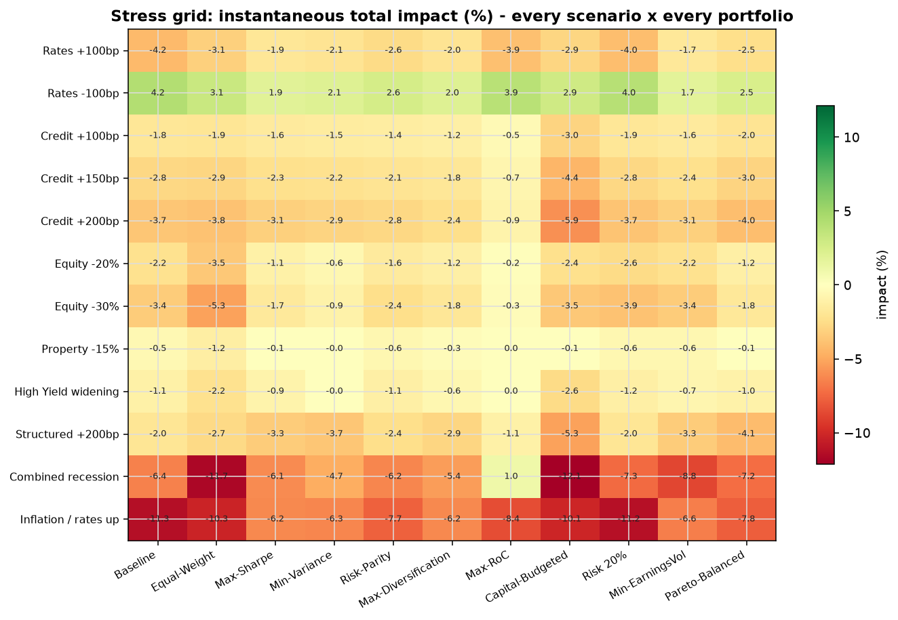

*Figure 4. Stress grid - every scenario against every portfolio (total impact, %).*

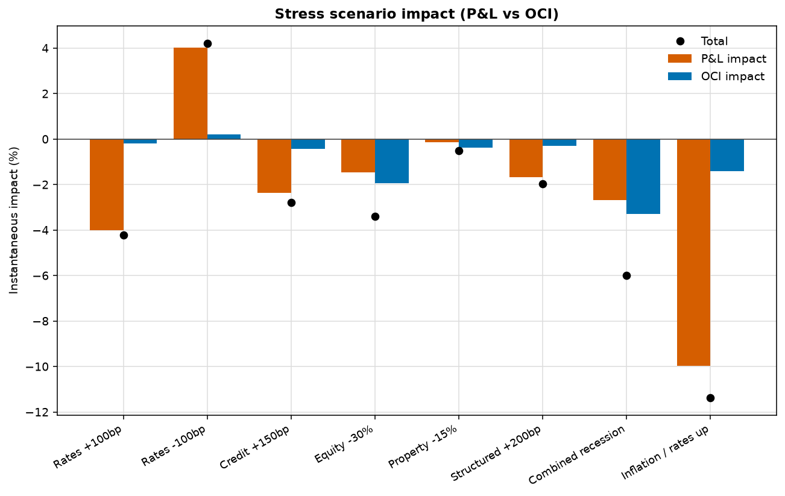

*Figure 5. Baseline stress impacts split into P&L and OCI.*

| metric | total_impact | pnl_impact | oci_impact |
|---|---|---|---|
| Rates +100bp | -0.0417 | -0.0397 | -0.0019 |
| Rates -100bp | 0.0417 | 0.0397 | 0.0019 |
| Credit +100bp | -0.0184 | -0.0156 | -0.0028 |
| Credit +150bp | -0.0276 | -0.0234 | -0.0042 |
| Credit +200bp | -0.0368 | -0.0312 | -0.0056 |
| Equity -20% | -0.0224 | -0.0097 | -0.0127 |
| Equity -30% | -0.0336 | -0.0145 | -0.0191 |
| Property -15% | -0.0050 | -0.0013 | -0.0036 |
| High Yield widening | -0.0105 | -0.0056 | -0.0049 |
| Structured +200bp | -0.0195 | -0.0166 | -0.0029 |
| Combined recession | -0.0644 | -0.0295 | -0.0349 |
| Inflation / rates up | -0.1126 | -0.0987 | -0.0139 |

**Why this lens.** Volatility describes a normal month; it says nothing about a specific, sudden move in rates, spreads or equities - the events that actually threaten the balance sheet and the earnings plan. Deterministic stress tests answer 'if *this* happens tomorrow, what do we lose, and does it hit earnings or reserves?'

**What it means.** Each loss is split into **P&L** (FVTPL - hits this year's earnings immediately) and **OCI** (FVOCI - sits in reserves and bypasses earnings). A rate shock that is painful economically can be nearly invisible to earnings if it lands in the OCI book, and vice versa - the distinction an insurer manages to.

**How it is calculated.** For every scenario, each asset is repriced first-order from its exposures: `-rate_duration x dRate - spread_duration x dSpread + equity_beta x dEquity + property_beta x dProperty`, weighted up to the portfolio. The panel deliberately includes single-factor *and* combined scenarios (shocks do not arrive in isolation), and the grid re-runs all of them against every portfolio.

**What we found.** The worst instantaneous scenario for the Baseline is **Inflation / rates up** at **-11.26%** (P&L -9.87%, OCI -1.39%). Rate shocks concentrate in the P&L (matched FI) book; equity/property shocks land in the OCI (surplus) book. The **Stress Loss** column in Part A is each portfolio's worst row here.

**What to study next.** Add second-order (convexity) terms for large moves, correlated multi-factor shocks calibrated to history, and a **reverse stress test** - solve for the scenario that breaches a chosen earnings or surplus limit, rather than guessing scenarios up front.

### B2. Lens 5 - LAGIC-style capital

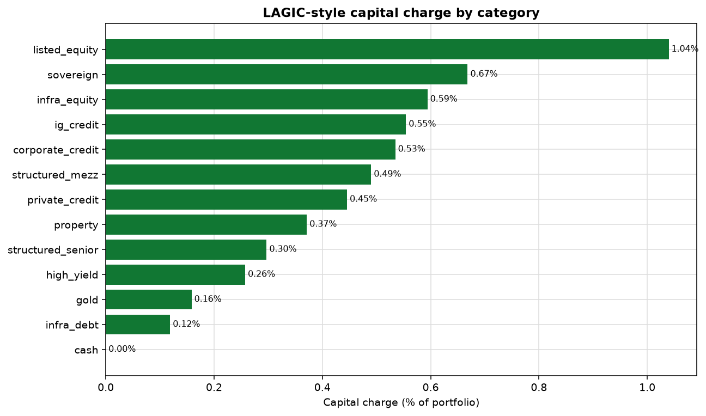

*Figure 6. Capital charge by category (Baseline).*

**Why this lens.** For a regulated insurer the scarce resource is **regulatory capital**, not volatility. Two books with the same Sharpe can tie up very different amounts of capital, so the honest measure of efficiency is **return on capital**. The lab originally lacked this lens - it is the gap that motivated the build.

**What it means.** The asset risk charge is the capital the regulator makes you hold against a prescribed worst case. It is fully **deterministic** - no return history is needed - so it is driven by *what you own*, not how it happened to trade.

**How it is calculated.** Each capital category carries a prescribed stress loss. A **panel of 8 scenarios** scales those stresses for different states of the world (equity/property crash, credit crisis, IG widening, structured shock, unlisted revaluation, rates/inflation, severe equity, broad recession); each scenario is aggregated with a category correlation, and the **worst of the 8 is the binding charge**. (The capital-aware *optimisers* use a smooth diversified-aggregate proxy because the worst-of-panel max is not differentiable.)

**What we found.** The binding charge is **2.54%** of assets, set by the **Broad recession** scenario (diversified-aggregate comparator **3.77%**); return on capital is **2.01x**. Largest consumers of capital in the binding scenario:

| metric | capital |
|---|---|
| Listed Equities | 0.0094 |
| Infra Equity | 0.0053 |
| Corporate Credit | 0.0037 |
| Private Credit | 0.0036 |
| Unlisted Property | 0.0030 |
| IG Credit | 0.0028 |

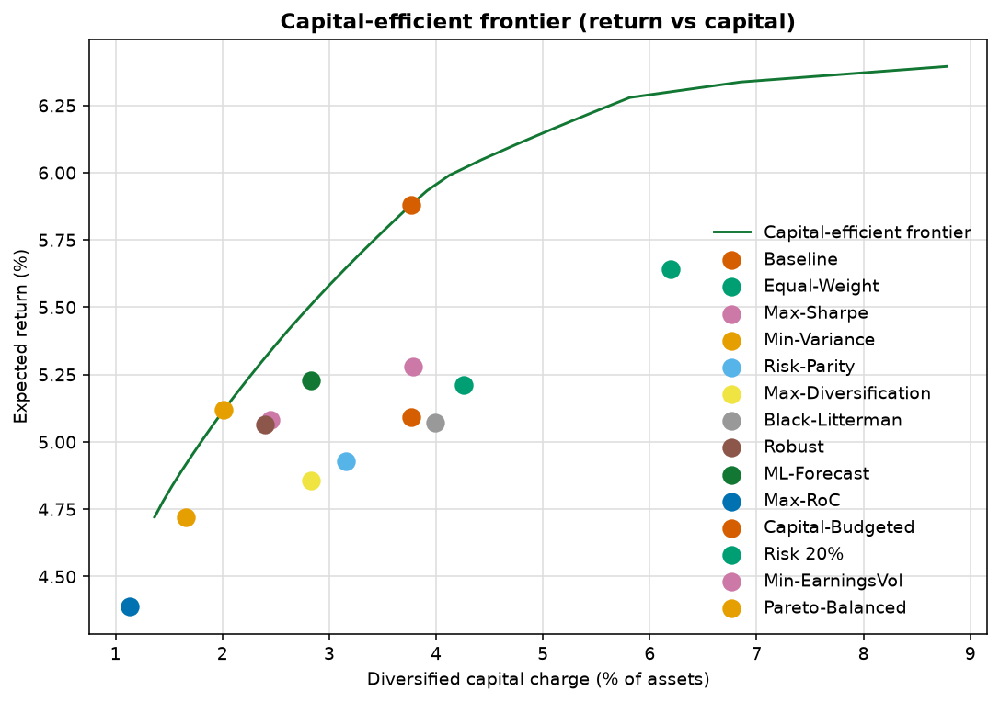

*Figure 7. Capital-efficient frontier (return vs capital).*

**What we found.** Optimising return **per unit of capital** (Max-RoC) reaches **4.39%** at a charge of just **1.03%** (RoC 4.24x). More usefully, **holding capital at the baseline's level**, the capital-budgeted optimiser lifts expected return to **5.88%** (vs 5.09%) - a clean 'grow the pie' result: more return for the *same* capital.

**What to study next.** Build toward a fuller LAGIC: add the interest-rate stress computed **net of liabilities** (not just assets), insurance- and operational-risk charges, the prescribed correlation matrix, and asset-concentration / counterparty add-ons. Then make capital a hard constraint in every optimiser, not just the capital-aware ones.

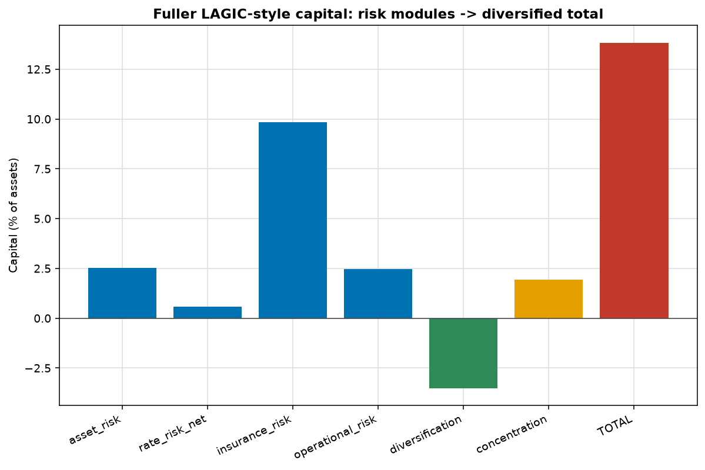

*Figure 7b. Fuller LAGIC-style build: risk modules aggregated (with diversification) to a total capital requirement.*

**Why this lens.** The asset risk charge above is only one module. A fuller capital requirement also holds capital for **interest-rate risk net of liabilities**, **insurance risk**, **operational risk** and **asset concentration** - and these do not all peak together, so they aggregate with a diversification credit.

**How it is calculated.** Each module is a prescribed charge: asset risk (worst-of-panel), the net asset-minus-liability duration gap x a prescribed rate move, insurance/operational risk scaled to liabilities/premiums, and an additive single-name concentration add-on. Modules combine via sqrt(m' R m) with a prescribed inter-module correlation.

**What we found.** Modules (% of assets): asset 2.54%, **rate-net-of-liabilities 0.57%** (small - the matched book does its job), insurance 9.84%, operational 2.46%. Diversified across modules that is **11.90%**, plus a 1.93% concentration add-on, for a **total capital requirement of 13.83%** of assets (return on total capital 0.37x).

**What to study next.** Replace the illustrative factors with the prescribed standard, add a real liability cash-flow model for the rate module, and counterparty-grade and reinsurance-recovery risk. The key structural point already holds: a duration-matched book keeps the rate module small.

### B3. Lens 3/6 - Through-time earnings & carry

**Why this lens.** An insurer is judged on whether it makes its **annual earnings plan**, not on a point-in-time Sharpe. That is the core point-in-time-vs-through-time tension: a portfolio can look efficient instantaneously yet miss the plan often because its return is volatile mark-to-market rather than predictable income.

**What it means.** Return splits into **carry** (predictable running yield, banked whatever happens) and **mark-to-market** (volatile price moves). The higher the carry share, the more reliably the plan is met. Carry on both books hits P&L; only the *price* move of OCI assets bypasses earnings.

**How it is calculated.** Each month is decomposed into carry vs MtM and P&L vs OCI, then aggregated to calendar-year earnings. For the tail we **block-bootstrap** the realised monthly P&L into thousands of synthetic plan-years (preserving short-run autocorrelation) and read off earnings-at-risk and CTE95 - resampling observed returns rather than assuming a bell curve.

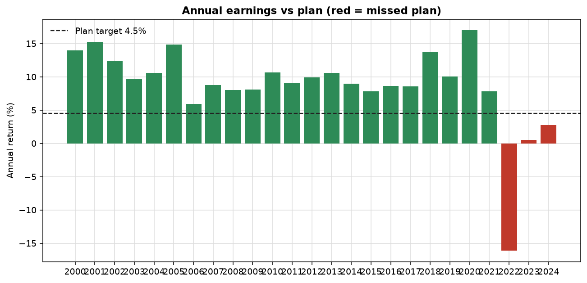

*Figure 8. Annual earnings vs plan (red = missed).*

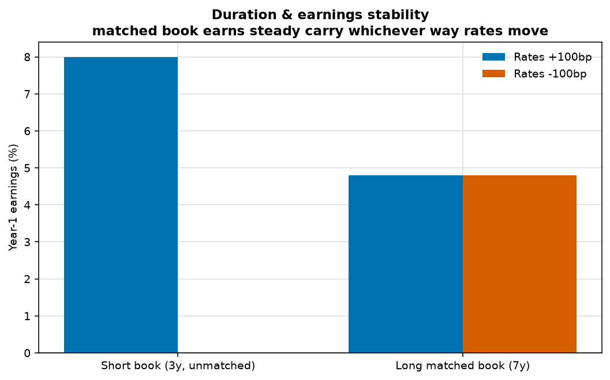

*Figure 9. Duration & earnings stability: a duration-matched book earns steady carry whichever way rates move; an unmatched book is an unhedged rate bet.*

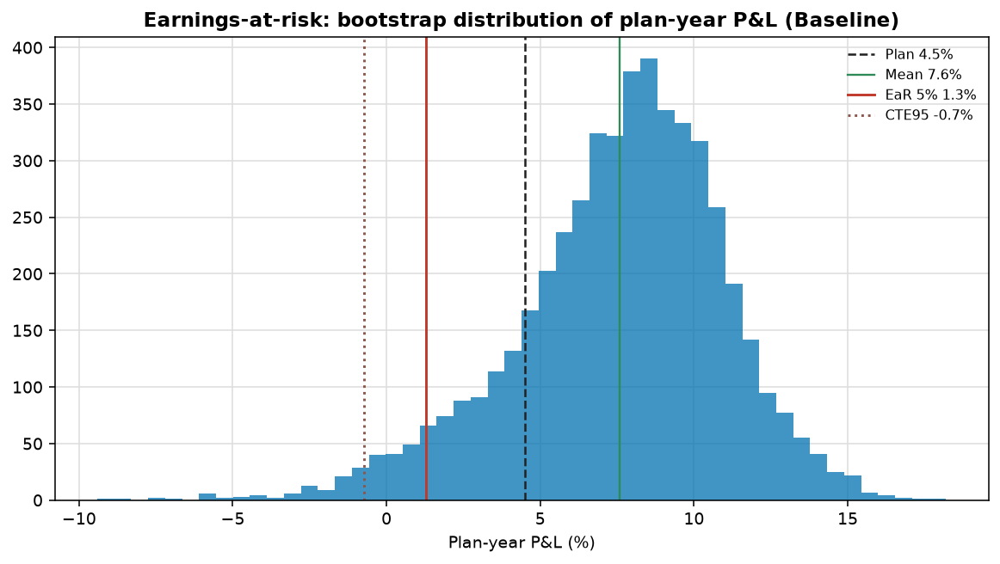

*Figure 10. Bootstrap distribution of plan-year P&L, with earnings-at-risk and CTE95.*

**What we found.** Annual earnings (P&L) volatility is **5.72%**; the chance of missing the 4.5% plan is **12%**; predictable **carry funds 59%** of the return. The bootstrap gives an **earnings-at-risk (5%) of 1.40%** and a **CTE95 of -0.53%** (mean of the worst 1-in-20 years) - the downside capital must absorb.

**What to study next.** Model the CFO's actual lever: a **dynamic duration glide path** that adds duration early in the plan year to protect the target and winds it down toward year-end. A full Monte-Carlo earnings simulation (paths, not just a bootstrap of the realised sample) would let that policy be optimised against plan-miss probability.

### B4. Lens 4 - Duration / ALM

**Why this lens.** Insurers hold assets to back insurance **liabilities**; the first-order balance-sheet risk is the **duration gap** between the two, by currency. The brief's structure is explicit: run the P&L (matched) book roughly $-for-$ against liabilities so earnings are rate-neutral, while taking deliberate surplus duration in the **OCI** book - long economically, but without disturbing P&L.

**What it means.** A rate move changes the economic surplus and reported earnings by *different* amounts. The difference is precisely the OCI/surplus book's rate exposure - duration you are paid to hold for the long-term economics but which is kept out of the earnings line.

**How it is calculated.** Asset dollar-durations (weight x duration) are split into P&L and OCI books per currency; liabilities are backed ~1:1 by the P&L book with durations from config. A +100bp parallel shock is then decomposed into the matched-book earnings impact (assets net of liabilities) and the full economic-surplus impact.

**What we found.** The total dollar-duration gap is **-0.29y**. A +100bp shock moves **economic surplus +0.29%** but **P&L earnings +0.48%** - the gap (**-0.19%**) is exactly the OCI/surplus rate exposure that bypasses earnings, confirming the matched-in-P&L / long-in-OCI design.

**What to study next.** Move from single effective duration to **key-rate durations** (curve twists and steepeners, not just parallel shifts), add cross-currency basis, and drive liabilities from an actuarial cash-flow model rather than a stylised duration per currency.

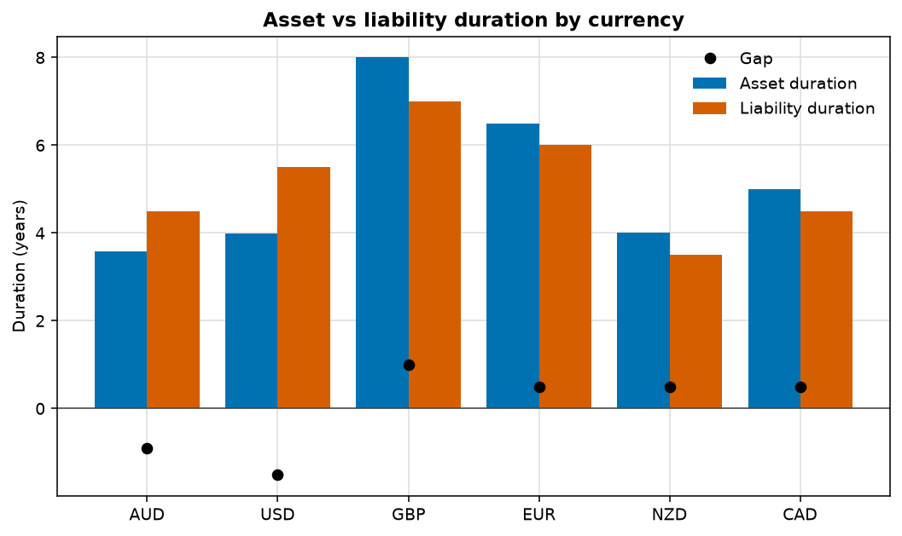

*Figure 11. Asset vs liability duration by currency.*

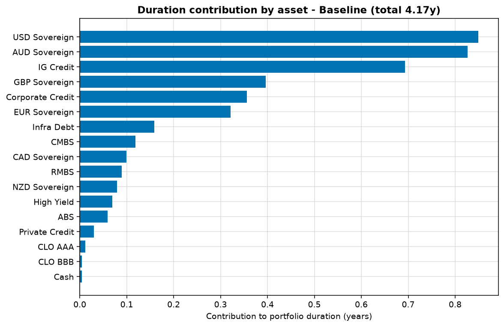

*Figure 12. Each asset's contribution to portfolio duration.*

### B5. Risk budgeting & diversification

**Why this lens.** Total volatility is one number; what a risk team manages is *where it comes from*. Two books with the same vol can be one diversified blend versus one concentrated bet - very different to govern.

**What it means.** Each asset's **risk contribution** is its share of portfolio volatility (the shares sum to 100%). The **diversification ratio** (weighted-average asset vol / portfolio vol) measures how much offset the correlations buy: 1.0 means none. Crucially, the **earnings-vol** budget differs from the total-risk budget - an asset can be small in one and large in the other.

**How it is calculated.** Risk contributions use marginal contribution to risk, MCTR_i = w_i (Sigma w)_i / vol. The earnings-vol budget attributes the variance of annual P&L to assets via cov(asset P&L, total P&L) / var(total P&L), so only the sleeves whose mark-to-market actually flows through earnings score.

**What we found.** Diversification ratio **1.83**; average pairwise correlation **0.23**. Earnings (P&L) volatility is concentrated in **AUD Sovereign** and **IG Credit** (21% and 21% of P&L variance) - the long-duration P&L bonds, *not* the headline risk assets. Top total-risk contributors:

**What to study next.** Risk contributions assume a stable covariance; stress them with **regime-dependent correlations** (which spike in a crisis) and add a **tail-risk contribution** (each asset's share of CVaR, not just variance).

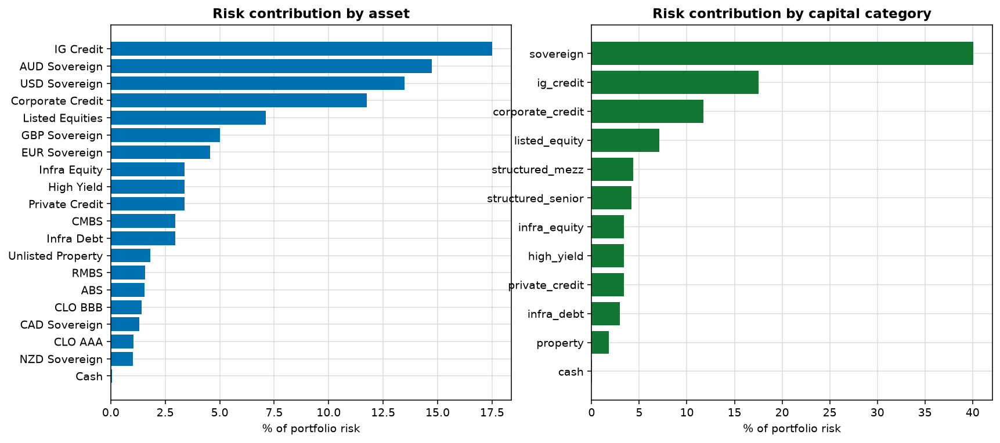

*Figure 13. Risk contribution by asset and by capital category.*

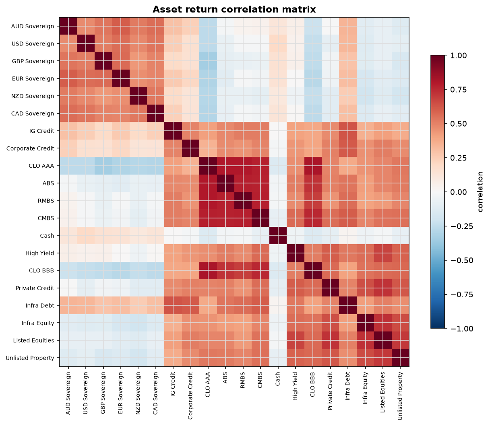

*Figure 14. Asset return correlation matrix.*

| metric | risk_% |
|---|---|
| IG Credit | 17.8000 |
| AUD Sovereign | 14.3000 |
| USD Sovereign | 13.2000 |
| Corporate Credit | 11.4000 |
| Listed Equities | 6.9000 |

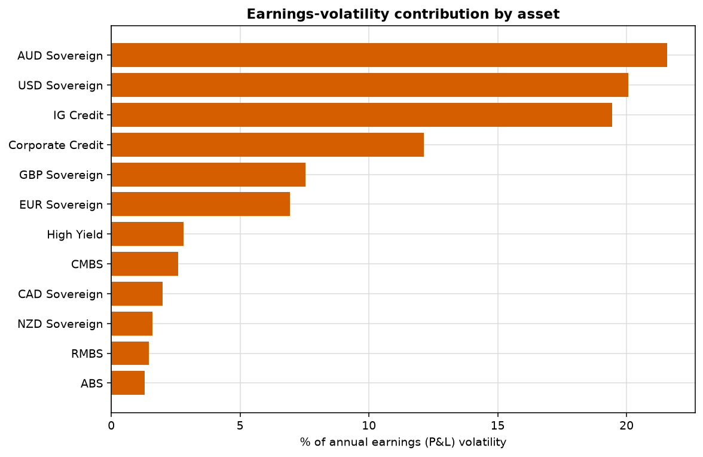

*Figure 15. Which sleeves drive annual earnings (P&L) volatility.*

### B6. Through-time return drivers (factor analysis)

**Why this lens.** Risk lenses say *how much* the book can move; they do not say *why* it moves. Factor analysis is the through-time view the brief kept circling: it separates return that is **paid factor premia / carry** from return that is a **time-varying factor bet** - and shows whether the recent record is skill or a one-off tailwind.

**What it means.** A factor **beta** is the book's sensitivity to a driver (e.g. a rate beta near minus the duration). The **attribution** turns each beta into the annualised return it contributed. **Rolling** betas show the exposures drifting - a flat average can hide a bet that was put on and taken off over the cycle.

**How it is calculated.** The book's monthly returns are regressed (OLS) on the macro/market factors - rates, credit spread, structured spread, equity, property, gold. Each factor's annual contribution = beta x mean monthly move x 12; the intercept is alpha/carry. Betas are then re-estimated on a rolling 36-month window.

**What we found.** The factors explain **88%** of monthly variation. The decomposition below shows return dominated by **alpha/carry** plus a positive **rates** contribution - i.e. predictable income plus the one-off secular fall in rates, not a repeatable directional skill. Attribution by factor:

| metric | beta | ann_contribution |
|---|---|---|
| Rates | -5.5079 | 0.0263 |
| Credit spread | -2.1666 | -0.0027 |
| Structured spread | -0.5083 | -0.0021 |
| Equity | 0.1209 | 0.0086 |
| Property | -0.0355 | -0.0018 |
| Gold | 0.0060 | 0.0001 |
| Alpha / carry | nan | 0.0538 |

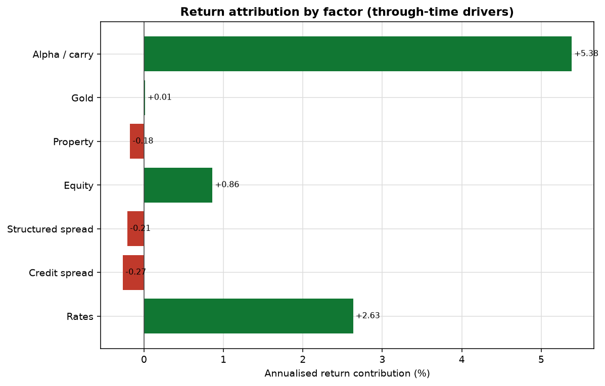

*Figure 16. Annualised return attributed to each macro/market factor (plus alpha/carry).*

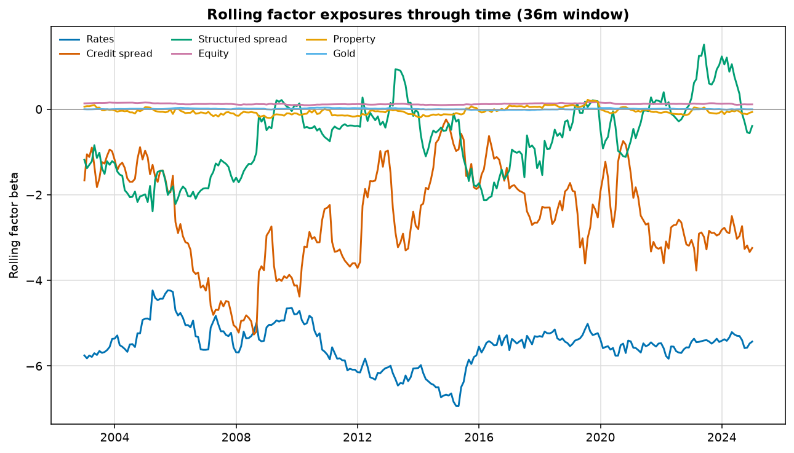

*Figure 17. Rolling factor betas - exposures drift through time.*

**What to study next.** On real data, swap the generative factors for **observable** market series (a rates index change, IG OAS, an equity index) so the decomposition is genuine. Then test **factor timing / regime conditioning** and separate factor risk-premia from true alpha - the foundation for the 'AI-side', through-time optimisation the brief asked for.

### B7. Liquidity, credit quality & solvency

**Why this lens.** A high-returning book is no good if it cannot raise cash in a stress without fire-sales, or if a shock wipes out the solvency buffer. This lens checks the book is *fundable* and *solvent*, not just efficient.

**What it means.** **Liquidity tiers** show how much can be sold quickly; **sub-investment-grade %** and **effective number of assets** flag credit and concentration risk; **surplus** (assets minus liabilities) is the capital buffer and **coverage** is assets / liabilities - what a worst-case stress eats into.

**How it is calculated.** Weights are bucketed by a liquidity score and by rating; concentration uses the Herfindahl index (effective N = 1 / sum of squared weights); surplus-at-risk applies the worst stress loss to the asset base and re-derives coverage.

**What we found.** **8%** of the book is illiquid; **5%** is sub-investment-grade; effective number of assets **11.2**. Surplus is **18%** of assets (coverage 1.22x); the worst stress erodes surplus by **-63%** to coverage 1.08x.

**What to study next.** Add a **liquidity-coverage** test (cash raisable in N days vs a stressed claims outflow), time-to-liquidate haircuts by tier, and counterparty / issuer concentration limits.

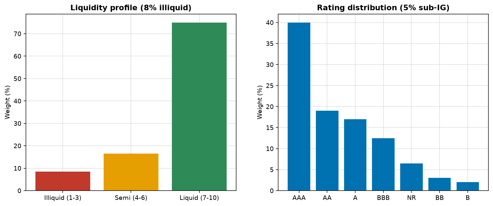

*Figure 18. Liquidity tiers and rating distribution.*

### B8. Marginal efficiency & historical stress

**Why this lens.** When capital or risk is the binding constraint, the question is not 'which asset has the best Sharpe' but 'which asset adds the most return for the next unit of *capital* (or risk) I spend'. And deterministic shocks should be sanity-checked against how the book *actually* behaved in real crises.

**What it means.** **Marginal efficiency** ranks assets by return per unit of marginal capital / marginal risk - the trade that improves the book at the margin. The **historical episodes** are a data-driven complement to the made-up scenarios: the realised drawdown through the GFC, COVID and the 2022 rate sell-off embedded in the data.

**How it is calculated.** Marginal capital is the asset's prescribed LAGIC stress; marginal risk is (Sigma w)_i / vol. Historical behaviour just compounds the portfolio's realised returns over each episode window.

**What we found.** The episode table below shows the 2022 rate sell-off, not the GFC, is this book's worst drawdown - a direct consequence of its duration, and a useful cross-check on the deterministic 'Rates / inflation' scenario being the worst instantaneous shock.

**What to study next.** Make the marginal trade **transaction-cost aware** (net of turnover) and condition the historical lens on the factor regime, so 'what hurt last time' is mapped to 'what we are exposed to now'.

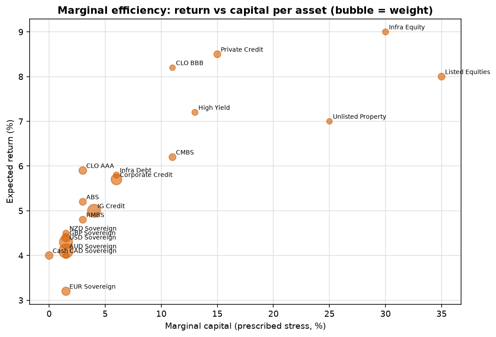

*Figure 19. Return vs marginal capital per asset (bubble = weight).*

Realised behaviour through the embedded historical episodes:

| metric | date | return |
|---|---|---|
| Worst single month | 2022-09-30 | -0.0242 |
| GFC (Sep08-Feb09) | - | -0.0181 |
| COVID (Feb-Mar20) | - | -0.0125 |
| Rate sell-off 2022 | - | -0.1614 |
| Max drawdown | 2022-12-31 | -0.1614 |

### B9. Within-asset-class diversification (implementation alpha)

**Why this lens.** An insurer's top-level allocation (the 85/15 split, the currency mix) is largely *given* - set by ALM and policy, not a free optimisation. But inside each class the *mix of sub-sleeves* is a genuine lever: small, repeatable 'implementation' alpha that is orthogonal to the SAA. The brief named structured credit as the growth area to investigate here.

**What it means.** The test is **same-risk return**: holding each class's volatility at its benchmark level, can a better sub-sleeve mix earn more? A pickup that survives **out-of-sample and net of trading cost** is real edge; one that only shows up in-sample is an over-fit mirage.

**How it is calculated.** Each class is decomposed into sub-sleeves (a shared-factor return model gives realistic, highly-correlated sub-returns). The enhanced mix maximises return subject to the benchmark-mix volatility. A walk-forward test then estimates the mix on a trailing window, applies it to the next year net of turnover cost, and accumulates the realised pickup. Structured credit is decomposed across CLOs by rating, ABS, RMBS and CMBS.

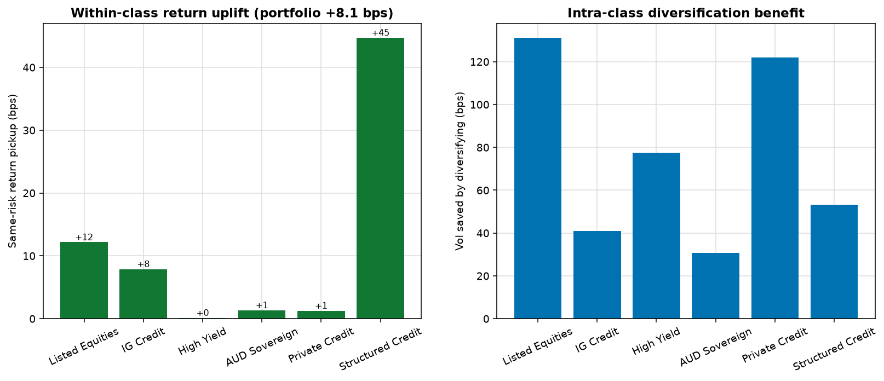

*Figure 20. Same-risk return pickup and diversification benefit by class.*

| metric | class_weight | incremental_return_bps | oos_pickup_net_bps | div_vol_saved_bps | oos_turnover | portfolio_uplift_bps | portfolio_oos_uplift_bps |
|---|---|---|---|---|---|---|---|
| Listed Equities | 0.0300 | 12.1810 | 55.4870 | 131.2040 | 0.0230 | 0.3620 | 1.6480 |
| IG Credit | 0.1390 | 7.9000 | 18.6150 | 40.9280 | 0.0340 | 1.0950 | 2.5800 |
| High Yield | 0.0200 | 0.1380 | -22.8880 | 77.5260 | 0.0300 | 0.0030 | -0.4530 |
| AUD Sovereign | 0.1650 | 1.3470 | -17.1430 | 30.6860 | 0.0090 | 0.2230 | -2.8340 |
| Private Credit | 0.0300 | 1.2790 | 0.8400 | 121.9840 | 0.0130 | 0.0380 | 0.0250 |
| Structured Credit | 0.1440 | 44.7210 | 35.0560 | 53.1750 | 0.0190 | 6.4200 | 5.0330 |

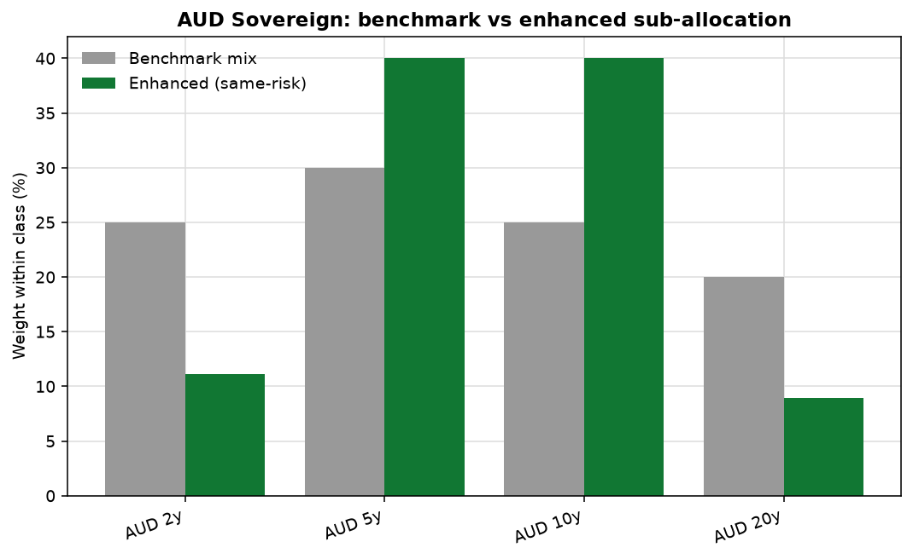

*Figure 21. AUD Sovereign: the enhanced mix tilts to the belly of the curve (5-10y), trimming the low-yield 2y and the high-vol 20y - more yield at the same duration risk.*

**What we found.** In-sample the same-risk pickup is **+8.1 bps** at the portfolio level (SAA unchanged); **out-of-sample and net of cost** it is **+6.0 bps**, and it concentrates where sub-sleeve dispersion is *structural*: **Structured Credit** (CLOs by rating, ABS/RMBS/CMBS) is the standout, with **Listed Equities** (region/style) and **IG Credit** (quality/sector) also paying; **High Yield, the sovereign curve and Private Credit** are too noisy to rely on. The OOS test is exactly what separates real edge from an in-sample mirage.

**What to study next.** Build structured credit out **granularly** - CLO tranches by rating and vintage, US vs EU, ABS/RMBS/CMBS sub-types on real index data - since it is both the strongest result here and the strategic growth area. Harvest only where dispersion is structural, size modestly, and rebalance slowly to keep turnover low.

#### B9a. Granular structured-credit deep-dive

**Why this lens.** Structured credit is the strategic growth area and the standout same-risk result, so it earns its own granular lens: CLOs AAA->BB (US/EU), ABS auto/card, RMBS prime/non-QM, CMBS conduit/SASB. It also splits across two capital buckets (senior ~3%, mezz ~11%), so the *capital* angle bites here specifically.

**How it is calculated.** Each tranche carries a forward return/vol, a LAGIC capital category and a real index ticker hook. Risk is empirical (tranche returns share the book's securitised factor plus dispersion). Two mixes are solved: **same-risk** (max return at the benchmark volatility) and **capital-efficient** (max return per unit of LAGIC capital).

**What we found.** The same-risk mix adds **+40 bps** at the benchmark volatility (6.29% -> 6.70%). The capital-efficient mix is more striking: by staying in **senior** tranches it lifts return on capital from 1.23x to **2.10x** and cuts the capital charge from 5.13% to 3.00% for almost the same return - the mezzanine reach is not paid for on a capital basis.

**What to study next.** Wire the real CLO/ABS/RMBS/CMBS index series (the tickers are in config), add vintage and manager dimensions, and model the capital *cliff* between senior and mezz explicitly - it is the dominant consideration for an insurer growing this book.

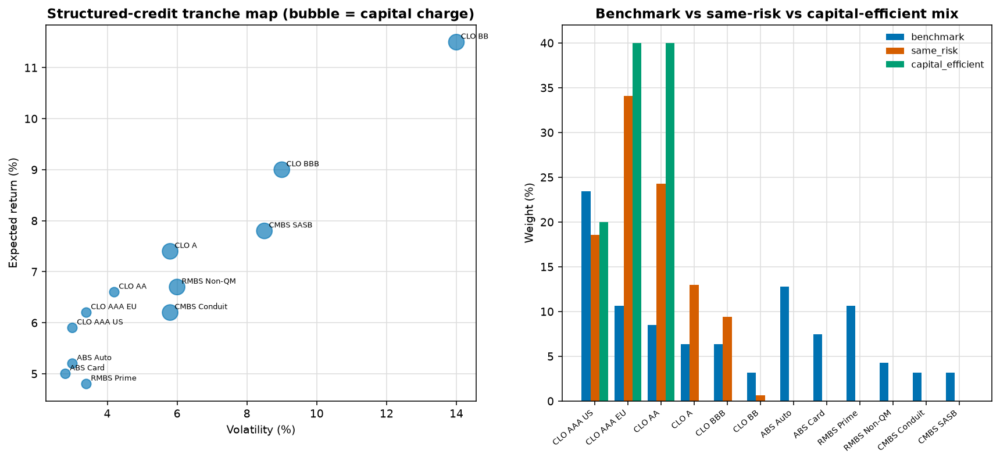

*Figure 21b. Structured-credit tranche map (bubble = capital) and the benchmark vs same-risk vs capital-efficient sub-allocation.*

| metric | benchmark | same_risk | capital_efficient | max_sharpe |
|---|---|---|---|---|
| CLO AAA US | 0.2340 | 0.1860 | 0.2000 | 0.4000 |
| CLO AAA EU | 0.1060 | 0.3410 | 0.4000 | 0.4000 |
| CLO AA | 0.0850 | 0.2430 | 0.4000 | 0.1610 |
| CLO A | 0.0640 | 0.1300 | 0.0000 | 0.0000 |
| CLO BBB | 0.0640 | 0.0940 | 0.0000 | 0.0000 |
| CLO BB | 0.0320 | 0.0070 | 0.0000 | 0.0000 |
| ABS Auto | 0.1280 | 0.0000 | 0.0000 | 0.0390 |
| ABS Card | 0.0740 | 0.0000 | 0.0000 | 0.0000 |
| RMBS Prime | 0.1060 | 0.0000 | 0.0000 | 0.0000 |
| RMBS Non-QM | 0.0430 | 0.0000 | 0.0000 | 0.0000 |
| CMBS Conduit | 0.0320 | 0.0000 | 0.0000 | 0.0000 |
| CMBS SASB | 0.0320 | 0.0000 | 0.0000 | 0.0000 |

### B10. Dynamic duration glide path (through-time earnings protection)

**Why this lens.** Every lens so far is a *position* at a point in time. But the CFO's real lever is a *policy through time*: hold interest-rate duration early in the plan year to earn the carry needed to make the number, then wind it down as that carry is banked so you stop carrying rate risk on earnings already secured. No point-in-time optimiser can see this - it is the gap the brief singled out, and the most novel piece here.

**What it means.** Duration is a genuine trade-off: it **earns a term premium** (the carry you need to clear the plan) but **bears rate risk**. A static duration over-holds risk all year; a glide winds it down on a fixed schedule; an **adaptive** policy holds duration while *behind* the plan pace and cuts it once *ahead* - banking the carry, then locking it in.

**How it is calculated.** Stylised 12-month simulation: monthly earnings = base carry + term-premium x d_t - d_t x dr_t + non-rate noise, with base carry set below plan (so duration is needed) and rate paths block-bootstrapped from history (demeaned). The static level, glide start and adaptive trigger are each optimised to minimise the plan-miss probability under common random numbers; duration is capped at a realistic ALM limit.

**What we found.** From the same duration budget, **management style is what matters**. A short book cannot make the plan (65% miss). A static-high book lowers the miss to 34% but at high earnings volatility (5.41%) and an ugly tail (EaR -3.59%). The **adaptive glide path is best: plan-miss 28% at the lowest earnings volatility (2.64%)** - bank the carry early, de-risk once ahead.

**What to study next.** Drive the policy off the *actual* P&L-book duration and liability profile (not a stylised term premium), let the optimiser choose the whole monthly schedule, and tie the trigger to the live earnings run-rate and a capital budget - a genuine dynamic asset-allocation overlay.

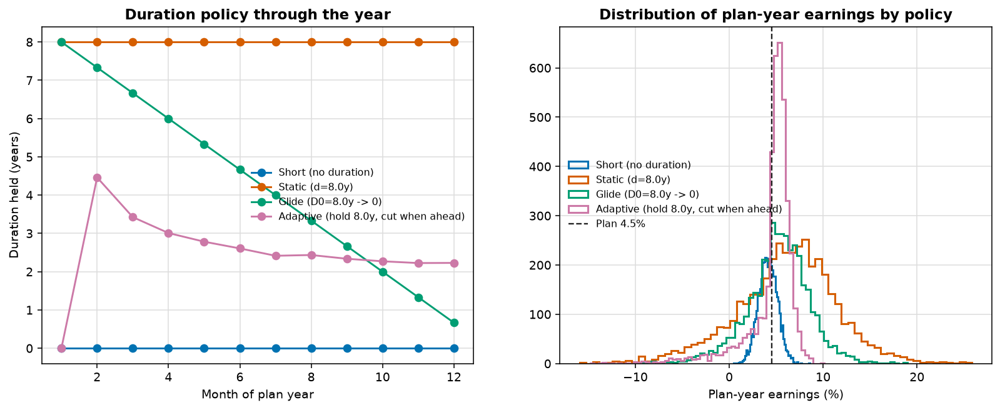

*Figure 22. Left: duration held through the plan year by policy (the adaptive path cuts once ahead of plan). Right: the resulting distribution of plan-year earnings.*

| metric | mean_earnings | earnings_vol | prob_miss_plan | earnings_at_risk_5pc |
|---|---|---|---|---|
| Short (no duration) | 0.0410 | 0.0101 | 0.6490 | 0.0244 |
| Static (d=8.0y) | 0.0604 | 0.0541 | 0.3418 | -0.0359 |
| Glide (D0=8.0y -> 0) | 0.0519 | 0.0335 | 0.3740 | -0.0065 |
| Adaptive (hold 8.0y, cut when ahead) | 0.0449 | 0.0264 | 0.2752 | -0.0096 |

### B11. Regime-conditional risk (correlations are not constant)

**Why this lens.** Every other lens uses one full-sample covariance, but diversification is a fair-weather friend: in a risk-off regime correlations rise and the book is riskier than its long-run number - precisely when capital and surplus are tested. An insurer must size risk for the bad regime, not the average one.

**What it means.** Splitting history into **risk-on** and **risk-off** months and re-computing risk shows how much of the headline diversification survives a crisis. The regime-conditional optimal book is what a regime-aware investor would hold if they knew which state they were in.

**How it is calculated.** A broad market proxy (equal-weight risk-asset return) defines the regime: trailing-3-month proxy return in the bottom tercile is risk-off, the rest risk-on. Covariance, average correlation, the baseline's volatility, the diversification ratio and a regime max-Sharpe are recomputed within each regime.

**What we found.** The baseline's volatility rises from **2.68%** (risk-on) to **3.73%** (risk-off) and its diversification ratio falls from **2.23** to **1.60** - the book is materially riskier in stress than its full-sample number suggests. The regime-optimal risk-off book de-risks hard into senior structured credit, cash and high-grade sovereigns.

**What to study next.** Replace the tercile rule with a formal **Markov-switching / HMM** classifier, feed the risk-off covariance into the capital and stress lenses (capital sized for the bad regime), and test a **regime-aware** dynamic allocation that de-risks on a regime signal.

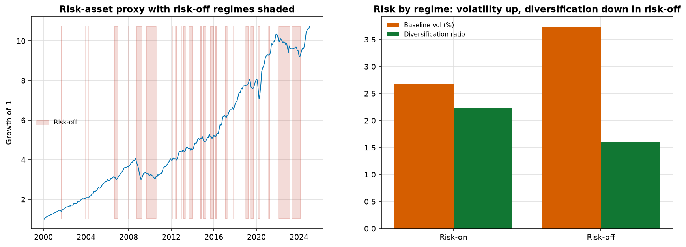

*Figure 23. Risk-asset proxy with risk-off regimes shaded; and the rise in volatility and fall in diversification when the regime turns.*

| metric | months | avg_correlation | baseline_vol | diversification_ratio | mean_monthly_return |
|---|---|---|---|---|---|
| Risk-on | 201.0000 | 0.2007 | 0.0268 | 2.2329 | 0.0104 |
| Risk-off | 99.0000 | 0.2053 | 0.0373 | 1.6025 | -0.0003 |

## Conclusion

No single construction philosophy captures an insurer's problem. Equal weight is the naive benchmark; Max-Sharpe improves risk-adjusted return; Min-Variance and Risk-Parity trade return for stability; Max-Diversification spreads correlation risk; the Max-RoC and Capital-Budgeted optimisers are far more capital-efficient. The right choice depends on which lens - return, drawdown, capital, earnings stability or ALM - is binding for the business at the time. The lab makes that trade-off explicit and is built to add new philosophies (Black-Litterman, robust, ML forecasts) behind the same comparison.

## Methodology & limitations

Dummy data is a factor model (rates/credit/equity/property/gold + idiosyncratic) with embedded GFC/COVID/2022 episodes. MVO uses forward `exp_return` assumptions and historical covariance. Realised-return, earnings-volatility and drawdown figures inherit the dummy data's one-off secular rate-decline tailwind and are illustrative, not forecasts. The LAGIC module is a simplified, illustrative asset-risk charge (worst of an 8-scenario prescribed panel) - not the legal standard; the capital-aware *optimisers* use a smooth diversified-aggregate proxy for the charge because it is differentiable (the worst-of-panel max is not), so their reported charge can differ slightly from the binding scenario. Stress impacts are first-order (duration/beta). Liabilities are stylised (backed ~1:1 by the P&L book; ratio 82% of assets). Risk assets are restricted to the big-four currencies. See `README.md` for how to drop in real data.
